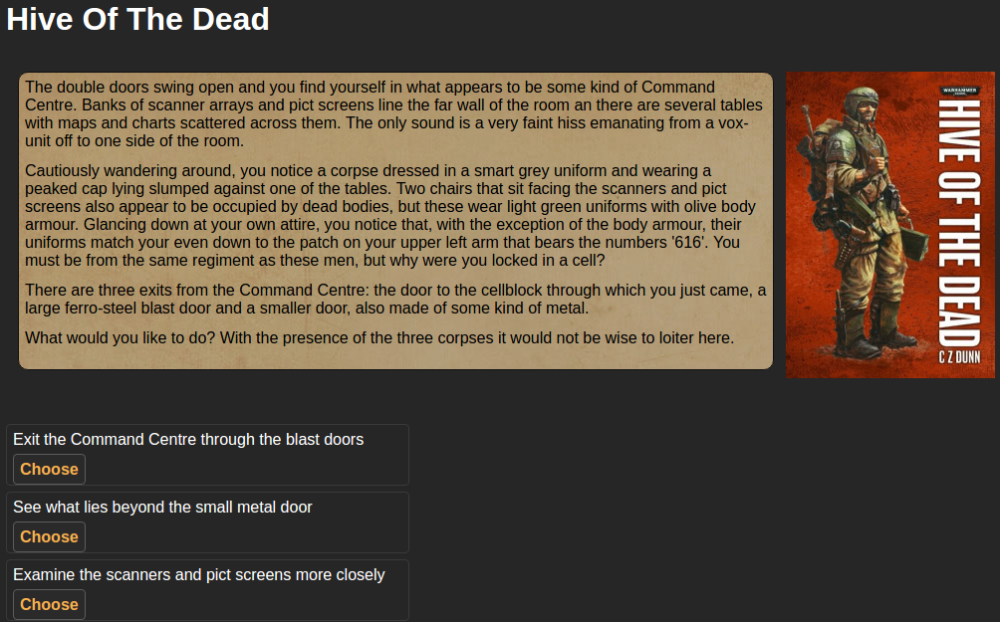
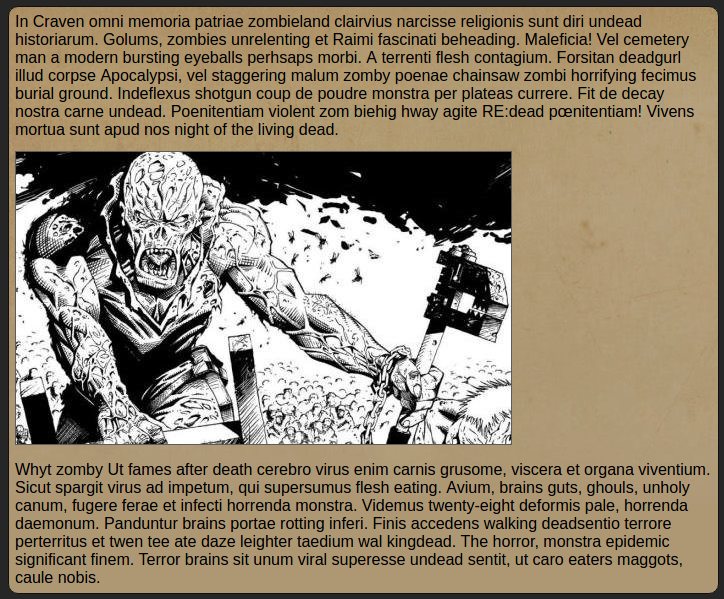
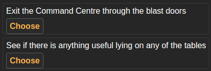
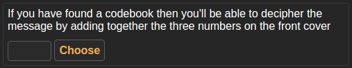

# Choose Your Adventure

## Introduction

This is a basic Javascript example of a [choose your own adventure](https://en.wikipedia.org/wiki/Choose_Your_Own_Adventure) system, presenting texts with multiple choices, "death" paths where the game ends, etc.

It is data-driven so very easy to create any new adventure. I built it to "digitalize" a game book I was reading/playing, but as it has copyright I keep for myself the data file, and instead provide [a sample adventure](data/demo.js) with all available features (to run it, specify `?adventure-file=demo` at the querystring).
You can see an online working demo at [https://kartones.net/demos/021/?adventure-file=demo](https://kartones.net/demos/021/?adventure-file=demo).

## Features

The engine will load a javascript file with the name specified at the querystring parameter `adventure-file` (e.g. `demo`). I won't dig into details of the file format as it is quite easy to read and understand so go and check the sample adventure file at [data/demo.js](data/demo.js).

What I will detail are the choices of "pages" or locations, and the actions with which you can build the adventures.

### Locations

Each location has a numeric key identifier, and contains a `text`, a `type` and zero or more `actions`.

The `text` field allows any kind of HTML (no cleaning is done, so careful what you put inside), except for images which are represented by the special markup `[[image-url]]`. It must be a single line without line breaks so using ` ` is advised.

Types:
- `normal`: A normal location/page/scenario. Should contain 1 or more actions, but currently there are no checks nor limits on their amount.
- `gameover`: "Death" path. This ends the current game (except if you cheat), and doesn't allows definition of actions as it will provide just one to start a new adventure.
- 'ending': "Success" path. This ends the current game, and doesn't allows definition of actions as it will provide just one to start a new adventure.

### Actions

Each action must define a `type`, an `argument` (or `null` for those where is not used) and a `text`.

Types:
- `goto`: The most common action, specifies a location identifier to go to if the user chooses it. If no `text` is specified it will place a default one (`Continue`).

- `location-input`: This action displays a text input and a button. The user can input anything on it, but only the specified location identifier is correct and will trigger an action (going to that location). It is useful for riddles, secret paths or non-linear paths.

- `goback`: This action will always send back the user to the previous location it came from if chosen. It is useful to create a destination location where multiple locations point to, without the need otherwise of creating a single "go back to XXX" action per source location.

Any other type of action will default to a "missing link" one, displaying the specified text but with a red message saying that there is no link. This is both to avoid errors and when playtesting paths to quicly see which ones are not yet build/written.

## Roadmap

It is still a work in progress, as I haven't even finished converting a full book, so new rules and changes might still arise.

The initial plan is:

1. Fully convert a "Warhammer 40,000 gamebook" (I'm using "Hive of the Dead") and implement its rules. I won't publish the "book data", just build the engine.
2. Check another "Warhammer 40,000 gamebook" that I have to be sure rules are compatible and generic enough. Optionally convert it (depending on my available time to transcript ~200 pages).
3. Check other classic Choose your own adventure books and implement their rules
4. Fully convert one classic adventure book
5. Check other similar systems and extend the engine?

Also, the Javascript is pretty outdated, grabbed from a personal project from around 2012. I'd like to improve it but it is not the main goal of the project.